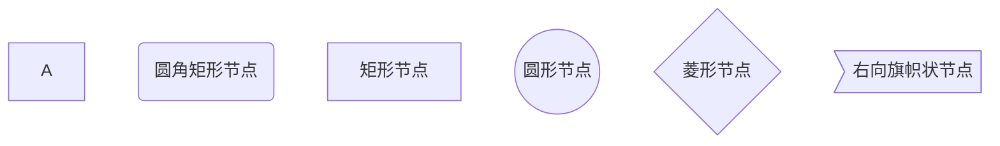

# 一、markdown的简介

> markdown是一种轻量级的标记语言 理念 markdown致力于让创作或则阅读文档变得更加的容易
>
> hyper text markup language （HTML）超文本标记语言
>
> [瀚淩博客](http://darker.hellosmile.xin/ )

# 二、标题

1.markdown的标题

>语法：# （一级标题） ##（二级标题）......

>代码：
>
>`# 这是一级标题`

>效果：
>
># 这是一级标题

> 快捷键：
>
> * ctrl+数字1-5  可以快速的将选中文字调成对应级别的标题
> * ctrl+加号/减号  对标题级别进行加减

# 三、段落

1、段落

>语法：直接进行文字的编辑如需新建下一段落 可直接换行 或则 在段落末尾 敲空格回车

>代码：
>
>`这是一个段落  `
>
>`这是一个段落`

> 效果：
>
> 这是一个段落
>
> 这是一个段落

2.字体

> 语法：
>
> 1. 粗体  用一对双 （*）包裹 
> 2. 删除线 用一对双（~）进行包裹 
> 3. 下划线 用一对（<u></u>）标签进行包裹
> 4. 斜体用一对 单（*）包裹

> 代码:
>
> `**这是粗体 **`
>
> `~~这是删除线~~ ` 
>
> `<u>这是下划线</u>`·
>
> `*这是斜体*`

> 效果：
>
> 效果：
>
> **这是粗体**
>
> ~~这是删除线~~
>
> <u>这是下划线</u>
>
> *这是斜体*

> 快捷键：
>
> 加粗：Ctrl+B
>
> 斜体：Ctrl+I
>
> 下划线：Ctrl+U

3.分割线

> 语法：
>
> 三个减号回车

> 代码：`---回车`

> 效果
>
> ---

4.脚注

> 说明：
>
> 脚注是对文本进行补充说明的

> 代码：
>
> `[^spring boot]`
>
> `[^spring boot]：这是一个非常好用的框架`

> 效果：
>
> 这是一个技术[^spring boot]
>
> [^spring boot]:这是一个非常好用的框架
>
> 

# 四、列表

1、无序列表

> 代码：
>
> `* 空格`

> 效果：
>
> 1、只有同一级别
>
> * 苹果
> * 香蕉
> * 橘子
>
> 2、子级别
>
> * 一级分类
>   * 二级分类【还是写*号】
>     * 三级分类

2、有序列表

> 代码：
>
> `1.空格`


> 效果：
>
> 1. 这是第一个标题
> 2. 这是第二个标题
>    * 这是子内容
> 3. 这是第三个标题

# 五、区块显示

> 代码:
>
> `>回车`

> 效果：
>
> >这是最外层的区块
> >
> >>这是内层
> >>
> >>> 这是再内层

* spring boot技术

  > spring boot技术xxxxxx

* spring cloud技术

  > sping cloud技术xxxxxx

# 六、代码块显示

> 代码：
>
> ````js/java/c#/text`
>
> 

> 效果：
>
> ```js
> function text(){
>     alert("hello Darker");
> }
> ```
>
> ```c#
> public class Test(){
>     public static void main(string[] args){
>         console.writeln("Hello Darker")；
>     }
> }
> ```
>
> 

# 七、链接

> 代码：
>
> `www.baidu.com`
>
> `[百度一下]（http://www.baidu.com）`

> 效果
>
> www.baidu.com
>
> [百度一下]（http://www.baidu.com）

# 八、图片插入

> 代码：
>
> `！[自定义图片的名称](图片的路径)`
>
> `如果设置了assets那就在格式→图像→插入图片`

> 效果：
>
> 

#  九、表格

> 代码：
>
> ```text
> |表头|表头|表头|
> |----|----|----|
> |1|2|3|
> ```
>
> 

> 效果：
>
> | 表头 | 表头 | 表头 |
> | ---- | ---- | ---- |
> | 1    | 2    | 3    |

> 快捷键：
>
> Ctrl+T

# 十、其他操作

> 代码：
>
> ```text
> 1、`ctrl`+`shift`+	`ESC` 查看任务管理器
> 2、<kbd>ctrl</kbd>
> ```

> 效果：
>
> 1、`ctrl`+`shift`+`ESC` 查看任务管理器
>
> 2、<kbd>ctrl</kbd>

# 十一、流程图

## 流程顺序

```text
首先要使用 ```mermaid
```

| 用词 |   含义   |
| :--: | :------: |
|  TB  | 从上到下 |
|  BT  | 从下到上 |
|  RL  | 从右到左 |
|  LR  | 从左到右 |


> 代码：
>
> ```text
> graph TB
> A-->B
> B-->C
> C-->A
> ```
>
> 

> 效果：
>
> ```mermaid
> graph TB
> A-->B
> B-->C
> C-->A
> ```
>
> 

## 常用符号及含义

节点形状

| 表述       | 说明           | 含义                                                 |
| :--------- | -------------- | ---------------------------------------------------- |
| id[文字]   | 矩形节点       | 表示过程，也就是整个流程中的一个环节                 |
| id（文字） | 圆角矩形节点   | 表示开始和结束                                       |
| id((文字)) | 圆形节点       | 表示连接，为避免流程过长或有交叉，可将流程切开，成树 |
| id{文字}   | 菱形节点       | 表示判断、决策                                       |
| id>文字]   | 右向旗帜状节点 |                                                      |

单向箭头线段：表示流程进行方向

> id既为节点的唯一标识，A-F是当前节点名字，类似于变量名，画图时便于引用
>
> 括号内是节点中要显示的文字，默认节点的名字的显示的文字都为A

```text
graph TB
A
B(圆角矩形节点)
C[矩形节点]
D((圆形节点))
E{菱形节点}
F>右向旗帜状节点]
```



> ### 例子1：
>
> ```text
> graph TB
> begin(出门)--> buy[买炸鸡]
> buy --> IsRemaining{" 还有没有炸鸡? "}
> IsRemaining --> |有|happyl买完炸鸡开心1--> goBack(回家 ) 
> IsRemaining --没有--> sad["伤心"]--> goBack
> ```
>
> 效果：
>
> ```mermaid
> graph TB
> begin(出门)--> buy[买炸鸡]
> buy --> IsRemaining{" 还有没有炸鸡? "}
> IsRemaining --> |有|happyl买完炸鸡开心1--> goBack(回家 ) 
> IsRemaining --没有--> sad["伤心"]--> goBack
> ```
>
> 

> ### 例子2：
>
> 子图表
>
> ```text
> subgraph 子图表名称
> 	子图表中的描述语句...
> end
> ```
>
> 代码：
>
> ```text
> graph TB
> subgraph 买炸鸡前
> 	begin(出门)--> buy[出门 门买炸鸡]
> end
> buy --> IsRemaining{" 还有没有炸鸡? "}
> IsRemaining --没有--> sad["伤心"]--> goBack(回家)
> IsRemaining --> |有|happy[买完炸鸡开心]--> goBack
> ```
>
> 效果：
>
> ```mermaid
> graph TB
> subgraph 买炸鸡前
> 	begin(出门)--> buy[出门 门买炸鸡]
> end
> buy --> IsRemaining{" 还有没有炸鸡? "}
> IsRemaining --没有--> sad["伤心"]--> goBack(回家)
> IsRemaining --> |有|happy[买完炸鸡开心]--> goBack
> ```
>
> 