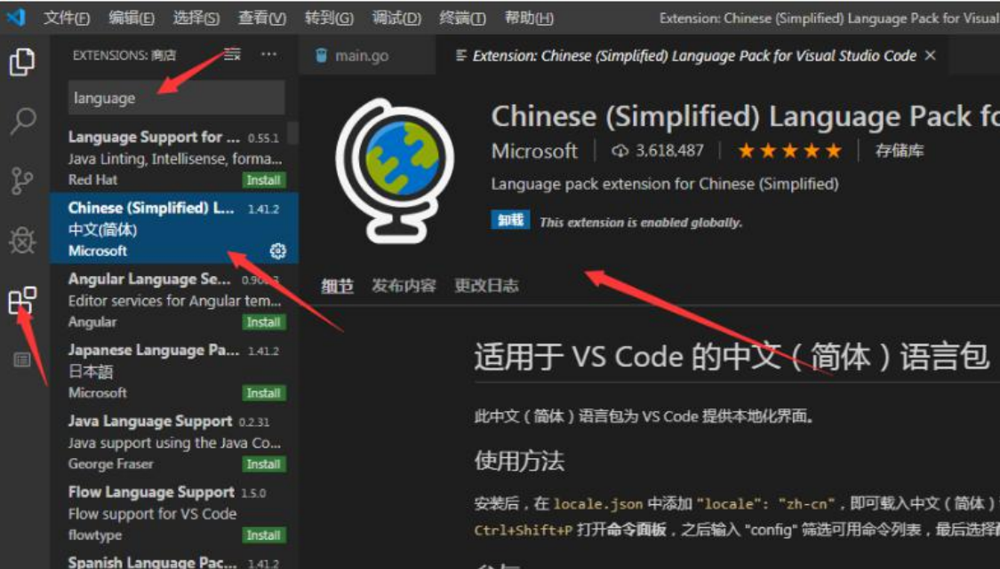
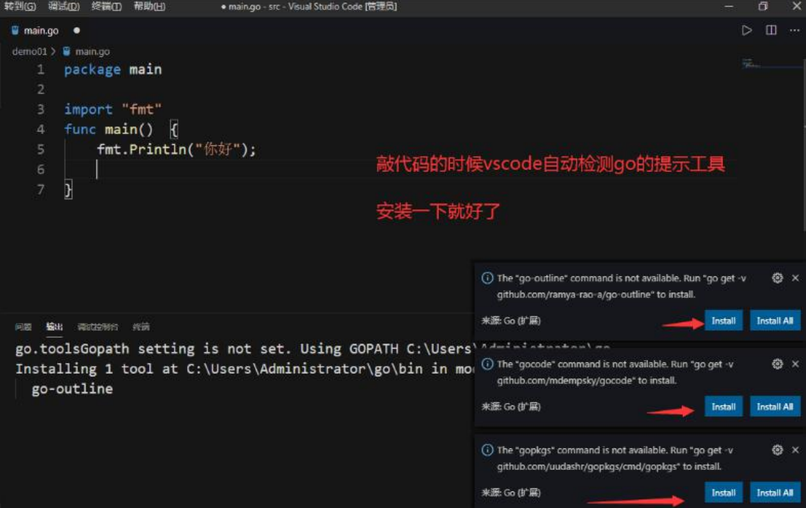
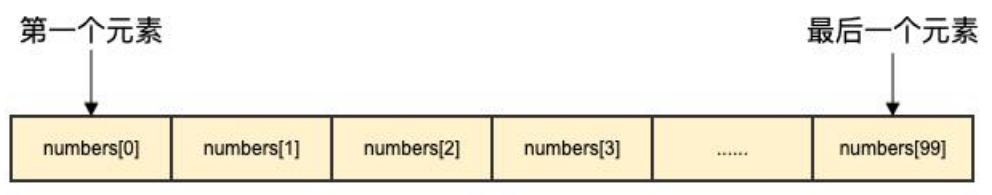
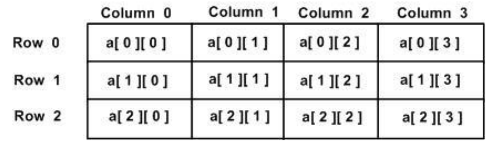
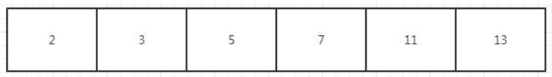
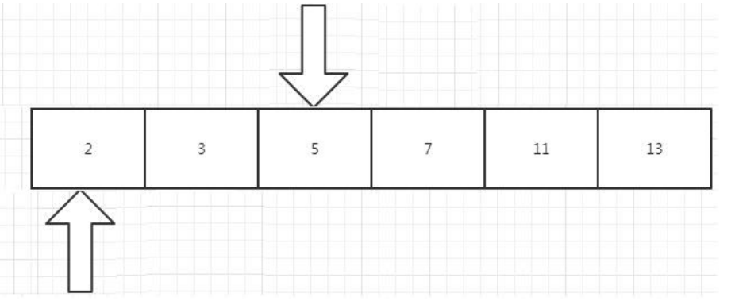
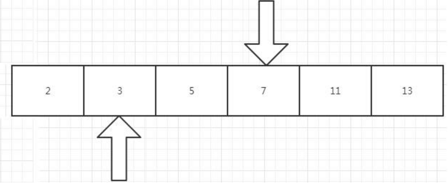
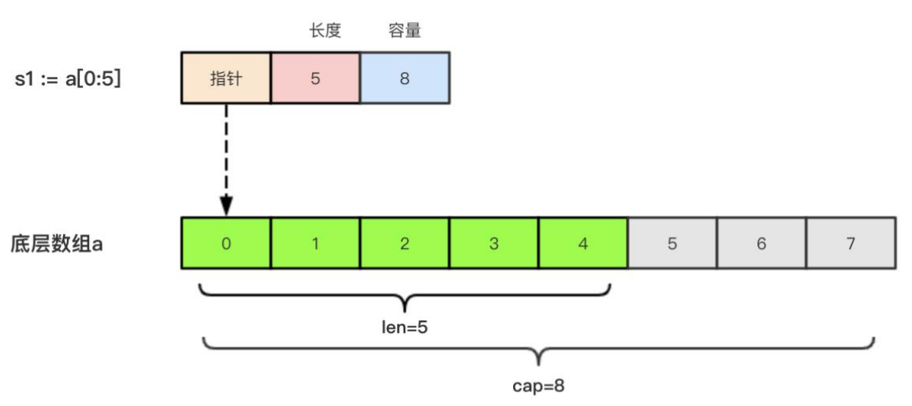
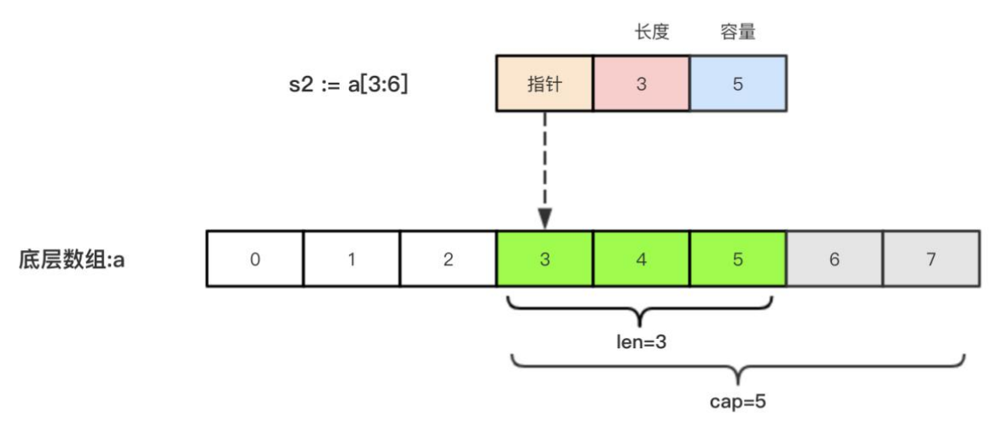

# Go 语言介绍

## 1、Go 语言介绍
Go 即 Golang，是 Google 公司 2009 年 11 月正式对外公开的一门编程语言。 根据 Go 语言开发者自述，近 10 多年，从单机时代的 C 语言到现在互联网时代的 Java， 都没有令人满意的开发语言，而 C++往往给人的感觉是，花了 100%的经历，却只有 60%的 开发效率，产出比太低，Java 和 C#的哲学又来源于 C++。并且，随着硬件的不断升级，这些 语言不能充分的利用硬件及 CPU。因此，一门高效、简洁、开源的语言诞生了。 Go 语言不仅拥有静态编译语言的安全和高性能，而且又达到了动态语言开发速度和易 维护性。有人形容 Go 语言：Go = C + Python , 说明 Go 语言既有 C 语言程序的运行速度，又 能达到 Python 语言的快速开发。 Go 语言是非常有潜力的语言，是因为它的应用场景是目前互联网非常热门的几个领域， 比如 WEB 开发、区块链开发、大型游戏服务端开发、分布式/云计算开发。国内比较知名的
			B 站就是用 Go 语言开发的，像 Goggle、阿里、京东、百度、腾讯、小米、360 的很多应用 也是使用 Go 语言开发的。

## 2、Go 语言成功的项目
nsq：bitly 开源的消息队列系统，性能非常高，目前他们每天处理数十亿条的消息 

docker：基于 lxc 的一个虚拟打包工具，能够实现 PAAS 平台的组建 

packer：用来生成不同平台的镜像文件，例如 VM、vbox、AWS 等，作者是 vagrant 的作者 

skynet：分布式调度框架 

Doozer：分布式同步工具，类似 ZooKeeper 

Heka：mazila 开源的日志处理系统 

cbfs：couchbase 开源的分布式文件系统 

tsuru：开源的 PAAS 平台，和 SAE 实现的功能一模一样 

groupcache：memcahe 作者写的用于 Google 下载系统的缓存系统

god：类似 redis 的缓存系统，但是支持分布式和扩展性 

gor：网络流量抓包和重放工具

## 3、哪些大公司在用 go 语言？
Google 这个不用多做介绍，作为开发 Go 语言的公司，当仁不让。Google 基于 Go 有很多优秀的 项目，比如：https://github.com/kubernetes/kubernetes ，大家也可以在 Github 上 https://github.com/google/ 查看更多 Google 的 Go 开源项目。 

Facebook 也在用，为此他们还专门在 Github 上建立了一个开源组织 facebookgo，大家 可以通过 https://github.com/facebookgo 访问查看 facebook 开源的项目，比如著 名的是平滑升级的 grace。

腾讯作为国内的大公司，还是敢于尝试的，尤其是 Docker 容器化这一块，他们在 15 年 已经做了 docker 万台规模的实践，具体可以参考 http://www.infoq.com/cn/articles/tencent-millions-scale-docker-application- practice 

百度目前所知的百度的使用是在运维这边，是百度运维的一个 BFE 项目，负责前端流量的接 入。他们的负责人在 2016 年有分享，大家可以看下这个 http://www.infoq.com/cn/presentations/application-of-golang-in-baidu-frontend

阿里巴巴具体的项目不太清楚，不过听说其系统部门、CDN 等正在招 Go 方面的人。 

京东京东云消息推送系统、云存储，以及京东商城等都有使用 Go 做开发。 

小米小米对 Golang 的支持，莫过于运维监控系统的开源，也就是 http://open-falcon.com/ 此外，小米互娱、小米商城、小米视频、小米生态链等团队都在使用 Golang。 

 360 对 Golang 的使用也不少，一个是开源的日志搜索系统 Poseidon，托管在 Github 上， https://github.com/Qihoo360/poseidon

## 4、Go 语言前景


## 5、Go 环境 win 环境搭建
1、下载安装 Golang Go 
官网下载地址：https://golang.org/dl/ 
Go 官方镜像站（推荐）：https://golang.google.cn/dl/

##  6、Go 语言开发工具 Vscode 配置
1、下载安装 vscode https://code.visualstudio.com/

2、汉化 vscode 



3、vscode 中安装 Go 语言插件




# **Go** 语言定义变量

关于变量：程序运行过程中的数据都是保存在内存中，我们想要在代码中操作某个数据时就 需要去内存上找到这个变量，但是如果我们直接在代码中通过内存地址去操作变量的话，代 码的可读性会非常差而且还容易出错，所以我们就利用变量将这个数据的内存地址保存起 来，以后直接通过这个变量就能找到内存上对应的数据了。

## 1、常见的变量定义方法

1、var定义变量

> var 变量名 类型 = 表达式
>
> var name string ="张三"

2、类型推导方式定义变量

在函数内部，可以使用更简略的 := 方式声明并初始化变量。 

<div style ='color:red;'>注意：短变量只能用于声明局部变量，不能用于全局变量的声明</div>

> 变量名 := 表达式
>
> n := 10

## 2、fmt 包、Print、Println、Printf

Go 中要打印一个值需要引入 fmt 包

> import "fmt"
>
> fmt 包里面给我们提供了一些常见的打印数据的方法，比如：Print 、Println、Printf，在我 们实际开发中 Println、Printf 用的非常多。

### 1、Print 和 Println 区别

一次输入多个值的时候 Println 中间有空格 Print 没有

```go
fmt.Println("go", "python", "php", "javascript") // go python php javascript 
fmt.Print("go", "python", "php", "javascript") // gopythonphpjavascript
```

###  2、Println 和 Printf 区别

Printf 是格式化输出，在很多场景下比 Println 更方便，举个例子：

```go
a := 10 
b := 20 
c := 30 
fmt.Println("a=", a, ",b=", b, ",c=", c) //a= 10 ,b= 20 ,c= 30 
fmt.Printf("a=%d,b=%d,c=%d", a, b, c) //a=10,b=20,c=30
```

%d 是占位符，表示数字的十进制表示。Printf 中的占位符与后面的数字变量一一对应。 更多的占位符参考：http://docscn.studygolang.com/pkg/fmt/

### 3、Go 语言中的注释
win 下面 ctrl+/ 可以快速的注释一样，mac 下面 command+/ 也可以快速的注释一样
```go
/* 
	这是一个注释 
*/

//这是一个注释
```

# Go 变量、常量、变量命名规则

## 1、变量的来历

程序运行过程中的数据都是保存在内存中，我们想要在代码中操作某个数据时就需要去内存 上找到这个变量，但是如果我们直接在代码中通过内存地址去操作变量的话，代码的可读性 会非常差而且还容易出错，所以我们就利用变量将这个数据的内存地址保存起来，以后直接 通过这个变量就能找到内存上对应的数据了。

## 2、变量类型

变量（Variable）的功能是存储数据。不同的变量保存的数据类型可能会不一样。经过半个 多世纪的发展，编程语言已经基本形成了一套固定的类型，常见变量的数据类型有：整型、 浮点型、布尔型等。 Go 语言中的每一个变量都有自己的类型，并且变量必须经过声明才能开始使用。

## 3、GO 语言中变量的声明

Go 语言变量名由字母、数字、下划线组成，其中首个字符不能为数字。Go 语言中关键字 和保留字都不能用作变量名。 

Go 语言中的变量需要声明后才能使用，同一作用域内不支持重复声明。 并且 Go 语言的变 量声明后必须使用。

### 1、var声明变量

```GO
var 变量名称 type

var name string 
var age int 
var isOk bool
```

### 2、一次定义多个变量

```go
var identifier1, identifier2 type

package main 
import "fmt" 
func main() { 
    var username, sex string
	username = "张三" 
    sex = "男" 
    fmt.Println(username, sex) 
}

申明变量的时候赋值 var a, b, c, d = 1, 2, 3, false
```

### 3、批量声明变量的时候指定类型

```go
var ( 
    a string 
    b int 
    c bool 
)
a = "张三" 
b = 10 
c = true 
fmt.Println(a,b,c)
```

批量声明变量并赋值

```go
var ( 
    a string = "张三" 
    b int = 20 
    c bool = true 
)
fmt.Println(a, b, c) 
fmt.Println(a,b,c)
```

### 4、变量的初始化

Go 语言在声明变量的时候，会自动对变量对应的内存区域进行初始化操作。每个变量会被 初始化成其类型的默认值，例如： 整型和浮点型变量的默认值为 0。 字符串变量的默认值 为空字符串。 布尔型变量默认为 false。 切片、函数、指针变量的默认为 nil。

当然我们也可在声明变量的时候为其指定初始值。变量初始化的标准格式如下：

>var name string = "zhangsan" 
>
>var age int = 18
>
>或者一次初始化多个变量并赋值
>
>var name, age = "zhangsan", 20

### 5、类型推导
有时候我们会将变量的类型省略，这个时候编译器会根据等号右边的值来推导变量的类型完 成初始化。
```go
var name = "Q1mi" 
var age = 18
```

###  6、短变量声明法
在函数内部，可以使用更简略的 := 方式声明并初始化变量。 
注意：短变量只能用于声明局部变量，不能用于全局变量的声明
>变量名 := 表达式
```go
package main 
	import ( 
        "fmt" 
    )
// 全局变量 
m var m = 100 
func main() { 
    n := 10 
    m := 200 // 此处声明局部变量 m 
    fmt.Println(m, n) 
}
```

使用变量一次声明多个变量，并初始化变量

```go
m1, m2, m3 := 10, 20, 30 
fmt.Println(m1, m2, m3)
```

### 7、匿名变量

在使用多重赋值时，如果想要忽略某个值，可以使用匿名变量（anonymous variable）。 匿 名变量用一个下划线_表示，例如：
```go
func getInfo() (int, string) { 
	return 10, "张三" 
}

func main() { 
    _, username := getInfo() 
    fmt.Println(username) 
}
```

>匿名变量不占用命名空间，不会分配内存，所以匿名变量之间不存在重复声明。
>
> 注意事项： 
>
>1、函数外的每个语句都必须以关键字开始（var、const、func 等） 
>
>2、:=不能使用在函数外。 
>
>3、_多用于占位，表示忽略值。

## 4、Go 语言中的常量

相对于变量，常量是恒定不变的值，多用于定义程序运行期间不会改变的那些值。 常量的声明和变量声明非常类似，只是把 var 换成了 const，常量在定义的时候必须赋值。

### 1、使用 const 定义常量

```go
const pi = 3.1415 
const e = 2.7182
```

`声明了 pi 和 e 这两个常量之后，在整个程序运行期间它们的值都不能再发生变化了。`

多个常量也可以一起声明：

```go
const (
    pi = 3.1415 
    e = 2.7182 
)
```

const 同时声明多个常量时，如果省略了值则表示和上面一行的值相同。 例如：

```go
const (
    n1 = 100 
    n2
    n3 
)
`上面示例中，常量 n1、n2、n3 的值都是 100。`
```
打印 Pi 的值

```go
package main 
import ( 
    "fmt" 
    "math" 
)
func main() { 
    const pi=math.Pi 
    fmt.Println(pi); 
}
```
### 2、const 常量结合 iota 的使用
iota 是 golang 语言的常量计数器,只能在常量的表达式中使用。
iota 在 const 关键字出现时将被重置为 0(const 内部的第一行之前)，const 中每新增一行常量 声明将使 iota 计数一次(iota 可理解为 const 语句块中的行索引)。
#### 1、iota 只能在常量的表达式中使用。
```go
fmt.Println(iota) 
编译错误： undefined: iota
```

#### 2、每次 const 出现时，都会让 iota 初始化为 0.【自增长】

```go
const a = iota // a=0 
const ( 
    b = iota //b=0 
    c //c=1 
)
```

#### 3、const iota 使用_跳过某些值

```GO
const ( 
    n1 = iota //0 
    n2 //1 
    _
    n4 //3 
)
```

#### 4、iota 声明中间插队

```go
const ( 
    n1 = iota //0 
    n2 = 100 //100 
    n3 = iota //2 
    n4 //3 
) 
const n5 = iota //0
```
#### 5、多个 iota 定义在一行

```go
const ( 
    a, b = iota + 1, iota + 2 //1,2 
    c, d //2,3 
    e, f //3,4 
)
```

## 5、Go 语言变量、常量命名规则

>1、变量名称必须由数字、字母、下划线组成。 
>
>2、标识符开头不能是数字 
>
>3、标识符不能是保留字和关键字。 
>
>4、变量的名字是区分大小写的如: age 和 Age 是不同的变量。在实际的运用中,也建议,不要 
>
>用一个单词大小写区分两个变量。
>
>5、标识符(变量名称)一定要见名思意 ：变量名称建议用名词，方法名称建议用动词 
>
>6、变量命名一般采用驼峰式，当遇到特有名词（缩写或简称，如 DNS）的时候，特有名词 
>
>根据是否私有全部大写或小写。

## 6、Go 语言代码风格

> 1、代码每一行结束后不用写分号（ `;`）
>
> 2、运算符左右建议各加一个空格` var username string = "itying" `
>
> 3、Go 语言程序员推荐使用`驼峰式命名` 
>
> 当名字有几个单词组成的时优先使用`大小写分隔 `
>
> 4、强制的代码风格 
>
> 左括号必须紧接着语句不换行，这个特性刚开始会使开发者不习惯，但随着对 Go 语言的 不断熟悉，就会发现风格统一让大家在阅读代码时把注意力集中到了解决问题上，而不是代 码风格上 
>
> 5、go fmt 主要用于格式化文档，让所有人的代码风格保持一致
>
> ```go
> D:\golang\src\demo01>go fmt main.go 
> main.go
> ```

# Go语言基本数据类型
## 1、Golang 数据类型介绍

>**Go** **语言中数据类型分为**：基本数据类型和复合数据类型 
>
>**基本数据类型有：** 整型、浮点型、布尔型、字符串 
>
>**复合数据类型有：** 数组、切片、结构体、函数、map、通道（channel）、接口等。

## 2、整型

整型分为以下两个大类： 

有符号整形按长度分为：int8、int16、int32、int64 

对应的无符号整型：uint8、uint16、uint32、uint64

| 类型   | 范围 | 占用空间 | 有无符号 |
| :----- | :--- | :------: | :------: |
| int8   |(-128 到 127) -2^7 到 2^7-1| 1个字节 | 有 |
| int16  |(-32768 到 32767) -2^15 到 2^15-1      | 2个字节 | 有 |
| int32  |(-2147483648 到 2147483647) -2^31 到 2^31-1      | 4个字节 | 有 |
| int64  |      (-9223372036854775808 到 9223372036854775807) -2^63 到 2^63-1| 8个字节 | 有 |
| uint8  |      (0 到 255) 0 到 2^8-1| 1个字节 | 无 |
| uint16 |      (0 到 65535) 0 到 2^16-1| 2个字节 | 无 |
| unit32 |    (0 到 4294967295) 0 到 2^32-1  | 4个字节 | 无 |
| unit64 |    (0 到 18446744073709551615) 0 到 2^64-1  | 8个字节 | 无 |

> 关于字节：
>字节也叫 Byte，是计算机数据的基本存储单位。8bit(位)=1Byte(字节) 1024Byte(字节)=1KB 1024KB=1MB 1024MB=1GB 1024GB=1TB 。在电脑里一个中文字是占两个字节的。

`特殊整型`

| 类型    | 描述                                                   |
| ------- | ------------------------------------------------------ |
| uint    | 32 位操作系统上就是 uint32，64 位操作系统上就是 uint64 |
| int     | 32 位操作系统上就是 int32，64 位操作系统上就是 int64   |
| uintptr | 无符号整型，用于存放                                   |

>注意：在使用 int 和 uint 类型时，不能假定它是 32 位或 64 位的整型，而是考虑 int 和 uint 可能在不同平台上的差异。
>
>注意事项：实际项目中整数类型、切片、 map 的元素数量等都可以用 int 来表示。在涉及到二进制传输、为了保持文件的结构不会受到不同编译目标平台字节长度的影响，不要使 用 int 和 uint。

```go
package main 
import ( 
    "fmt" 
)
func main() {
    var num int64 
    num = 123 
    fmt.Printf("值:%v 类型%T", num, num) 
}
```

### unsafe.Sizeof

> unsafe.Sizeof(n1) 是 unsafe 包的一个函数，可以返回 n1 变量占用的字节数

```go
package main 
import ( 
    "fmt" 
    "unsafe" 
)

func main() { 
    var a int8 = 120 
    fmt.Printf("%T\n", a) 
    fmt.Println(unsafe.Sizeof(a)) 
}
```

### int不同长度直接的转换

```go
package main 
import ( 
    "fmt" 
)
func main() { 
    var num1 int8 
    num1 = 127 
    num2 := int32(num1) 
    fmt.Printf("值:%v 类型%T", num2, num2) //值:127 类型 int32 
}
```

### 数字字面量语法（Number literals syntax）（了解）

> Go1.13 版本之后引入了数字字面量语法，这样便于开发者以二进制、八进制或十六进制浮 点数的格式定义数字，例如：
>
> v := 0b00101101， 代表二进制的 101101，相当于十进制的 45。
>
> v := 0o377，代表八进制的377，相当于十进制的 255。 
>
> v := 0x1p-2，代表十六进制的 1 除以 2²，也就是 0.25。
>
>  而且还允许我们用 _ 来分隔数字，比如说：
>
> v := 123_456 等于 123456。
>
> 我们可以借助 fmt 函数来将一个整数以不同进制形式展示。

```GO
package main 
import "fmt" 
func main(){ 
    // 十进制 
    var a int 
    a = 10 
    fmt.Printf("%d \n", a) // 10 
    fmt.Printf("%b \n", a) // 1010 占位符%b 表示二进制 
    
    // 八进制 以 0 开头 
    var b int 
    b = 077 
    fmt.Printf("%o \n", b) // 77 
    
    // 十六进制 以 0x 开头 
    var c int 
    c = 0xff 
    fmt.Printf("%x \n", c) // ff 
    fmt.Printf("%X \n", c) // FF 
    fmt.Printf("%d \n", c) // 255 
}
```

[参考fmt用法:http://docscn.studygolang.com/pkg/fmt/](http://docscn.studygolang.com/pkg/fmt/)

## 3、浮点型
Go 语言支持两种浮点型数：float32 和 float64。这两种浮点型数据格式遵循 IEEE 754 标准： float32 的浮点数的最大范围约为 3.4e38，可以使用常量定义：math.MaxFloat32。float64 的 浮点数的最大范围约为 1.8e308，可以使用一个常量定义：math.MaxFloat64。

打印浮点数时，可以使用 fmt 包配合动词%f，代码如下：

```go
package main 
import ( 
    "fmt" 
    "math" 
)
func main() { 
    fmt.Printf("%f\n", math.Pi) //默认保留 6 位小数 
    fmt.Printf("%.2f\n", math.Pi) //保留 2 位小数 
}
```

### Go 语言中浮点数默认是 float64

```go
num := 1.1 
fmt.Printf("值：%v--类型:%T", num, num) //值：1.1--类型:float64
```

### Golang中float精度丢失问题

几乎所有的编程语言都有精度丢失这个问题，这是典型的二进制浮点数精度损失问题，在定 长条件下，二进制小数和十进制小数互转可能有精度丢失。

```go
d := 1129.6 
fmt.Println((d * 100)) //输出：112959.99999999999

var d float64 = 1129.6 
fmt.Println((d * 100)) //输出：112959.99999999999

m1 := 8.2 
m2 := 3.8 
fmt.Println(m1 - m2) // 期望是 4.4，结果打印出了 4.399999999999999
```

**使用第三方包来解决精度损失问题：**https://github.com/shopspring/decimal

**Golang** **科学计数法表示浮点类型**

```go
num8 := 5.1234e2 // ? 5.1234 * 10 的 2 次方 
num9 := 5.1234E2 // ? 5.1234 * 10 的 2 次方 shift+alt+向下的箭头 
num10 := 5.1234E-2 // ? 5.1234 / 10 的 2 次方 0.051234 
fmt.Println("num8=", num8, "num9=", num9, "num10=", num10)
```

## 4、布尔值

Go 语言中以 bool 类型进行声明布尔型数据，布尔型数据只有 true（真）和 false（假）两个值。

**注意：** 

1. 布尔类型变量的默认值为 false。 
2. Go 语言中不允许将整型强制转换为布尔型. 
3. 布尔型无法参与数值运算，也无法与其他类型进行转换。

```go
package main 
import ( 
    "fmt" 
    "unsafe" 
)

func main() { 
    var b = true 
    fmt.Println(b, "占用字节：", unsafe.Sizeof(b)) 
}
```

## 5、字符串

Go 语言中的字符串以原生数据类型出现，使用字符串就像使用其他原生数据类型（int、bool、 float32、float64 等）一样。 Go 语言里的字符串的内部实现使用 UTF\-8 编码。 字符串的值 为双引号(")中的内容，可以在 Go 语言的源码中直接添加非 ASCII 码字符，例如：

```go
s1 := "hello" 
s2 := "你好"
```

### **字符串转义符**

Go 语言的字符串常见转义符包含回车、换行、单双引号、制表符等，如下表所示。

| 转义符 | 含义               |
| ------ | ------------------ |
| \r     | 回车符（返回行首） |
| \n     |                    换行符（直接跳到下一行的同列位置）|
| \t     |                    制表符|
| \\\'   |                   单引号 |
| \\\"   |                    双引号|
| \\\    |                   反斜杠 |

`举个例子，我们要打印一个 Windows 平台下的一个文件路径：`

```go
package main 
import ( 
    "fmt" 
)
func main() { 
    fmt.Println("str := \"c:\\Code\\demo\\go.exe\"") 
}
```

### 多行字符串

```go
Go 语言中要定义一个多行字符串时，就必须使用反引号字符：
s1 := `第一行
		第二行
		第三行 `
 fmt.Println(s1) 
反引号间换行将被作为字符串中的换行，但是所有的转义字符均无效，文本将会原样输出。
```

### 字符串的常用操作

| 方法                                | 介绍           |
| ----------------------------------- | -------------- |
| len(str)                            | 求长度         |
| +或 fmt.Sprintf                     | 拼接字符串     |
| strings.Split                       | 分割           |
| strings.contains                    | 判断是否包含   |
| strings.HasPrefix,strings.HasSuffix | 前缀/后缀判断  |
| strings.Index(),strings.LastIndex() | 子串出现的位置 |
| strings.Join(a[]string, sep string) | join 操作      |

#### len(str)求字符串的长度

```go
var str = "this is str"
fmt.Println(len(str))
```

#### 拼接字符串

```go
var str1 = "你好" 
var str2 = "golang" 
fmt.Println(str1 + str2) 
var str3 = fmt.Sprintf("%v %v", str1, str2) 
fmt.Println(str3)
```

#### strings.Split 分割字符串

```go
var str = "123-456-789"
var arr = strings.Split(str, "-") 
fmt.Println(arr)
```

#### 拼接字符串

```go
var str = "this is golang" 
var flag = strings.Contains(str, "golang") 
fmt.Println(flag)
```

#### 判断首字符尾字母是否包含指定字符

```go
var str = "this is golang" 
var flag = strings.HasPrefix(str, "this") 
fmt.Println(flag) 
var str = "this is golang" 
var flag = strings.HasSuffix(str, "go") 
fmt.Println(flag)
```

#### **判断字符串出现的位置**

```go
var str = "this is golang" 
var index = strings.Index(str, "is") //从前往后 
fmt.Println(index) 
var str = "this is golang" 
var index = strings.LastIndex(str, "is") //从后网前 
fmt.Println(index)
```

#### **Join** **拼接字符串**

```go
var str = "123-456-789" 
var arr = strings.Split(str, "-") 
var str2 = strings.Join(arr, "*") 
fmt.Println(str2)
```
## 6、byte 和 rune 类型

组成每个字符串的元素叫做“字符”，可以通过遍历字符串元素获得字符。 字符用单引号（’） 包裹起来，如：

```go
package main 
import "fmt" 
func main() { 
    a := 'a' 
    b := '0' 
    //当我们直接输出 byte（字符）的时候输出的是这个字符对应的码值 
    fmt.Println(a) 
    fmt.Println(b) 
    
    //如果我们要输出这个字符，需要格式化输出 
    fmt.Printf("%c--%c", a, b) //%c 相应 Unicode 码点所表示的字符 
}
```
字节（byte）：是计算机中 数据处理 的基本单位，习惯上用大写 B 来表示,1B（byte,字节） = 8bit（位） 

字符：是指计算机中使用的字母、数字、字和符号 

`一个汉子占用 3 个字节 一个字母占用一个字节`

```go
a := "m" 
fmt.Println(len(a)) //1 

b := "张" 
fmt.Println(len(b)) //3
```

### Go语言的字符有以下两种

1. uint8 类型，或者叫 byte 型，代表了 ASCII 码的一个字符。 

2.  rune 类型，代表一个 UTF-8 字符。

 当需要处理中文、日文或者其他复合字符时，则需要用到 rune 类型。rune 类型实际是一个 int32。 

Go 使用了特殊的 rune 类型来处理 Unicode，让基于 Unicode 的文本处理更为方便，也可以使用 byte 型进行默认字符串处理，性能和扩展性都有照顾。

```go
// 遍历字符串 
package main 
import "fmt" 
func main() { 
    s := "hello 张三" 
    for i := 0; i < len(s); i++ { //byte 
        fmt.Printf("%v(%c) ", s[i], s[i]) 
    }
    fmt.Println() 
    
    for _, r := range s { //rune 
        fmt.Printf("%v(%c) ", r, r) 
    }
    fmt.Println() 
}
```

> 输出：
>
> 104(h) 101(e) 108(l) 108(l) 111(o) 32( ) 229(å) 188(¼) 160( ) 228(ä) 184(¸) 137() 104(h) 101(e) 108(l) 108(l) 111(o) 32( ) 24352(张) 19977(三)
>
> 因为 UTF8 编码下一个中文汉字由 3 个字节组成，所以我们不能简单的按照字节去遍历一个 包含中文的字符串，否则就会出现上面输出中第一行的结果。
>
> 字符串底层是一个 byte 数组，所以可以和[]byte 类型相互转换。字符串是不能修改的 字符 串是由 byte 字节组成，所以字符串的长度是 byte 字节的长度。 rune 类型用来表示 utf8 字 符，一个 rune 字符由一个或多个 byte 组成。

**rune 类型实际是一个int32**

```go
c3 := "营" 
c4 := '营' 
fmt.Printf("C3 的类型%T--C4 的类型%T", c3, c4) //C3 的类型 string--C4 的类型 int32
```

## 7、修改字符串

要修改字符串，需要先将其转换成[]rune 或[]byte，完成后再转换为 string。无论哪种转换， 都会重新分配内存，并复制字节数组。

```go
func changeString() { 
    s1 := "big" 
    // 强制类型转换 
    byteS1 := []byte(s1) 
    byteS1[0] = 'p' 
    fmt.Println(string(byteS1)) 
    s2 := "白萝卜" 
    runeS2 := []rune(s2) 
    runeS2[0] = '红' 
    fmt.Println(string(runeS2)) 
}
```

# Golang中的运算符

## 1、Golang内置的运算符

1. 算术运算符 

2. 关系运算符
3. 逻辑运算符 

4. 位运算符 

5. 赋值运算符

## 2、算数运算符

| 运算符 | 描述 |
| ------ | ---- |
| +      | 相加 |
| -      | 相减 |
| *      | 相乘 |
| /      | 相除 |
| %      | 求余=被除数-（被除数/除数）*除数|

**注意：** ++（自增）和 --（自减）在 Go 语言中是单独的语句，并不是运算符。

```go
package main 
import ( 
    "fmt" 
)
func main() { 
    fmt.Println("10+3=", 10+3) // =13 
    fmt.Println("10-3=", 10-3) // =7 
    fmt.Println("10*3=", 10*3) // =30 
    
    //除法注意：如果运算的数都是整数，那么除后，去掉小数部分，保留整数部分 
    fmt.Println("10/3=", 10/3) //3 
    fmt.Println("10.0/3=", 10.0/3) //3.3333333333333335 
    
    // 取余注意 余数=被除数-（被除数/除数）*除数 
    fmt.Println("10%3=", 10%3) // =1 
    fmt.Println("-10%3=", -10%3) // -1 
    fmt.Println("10%-3=", 10%-3) // =1 
    fmt.Println("-10%-3=", -10%-3) // =-1 
}
```

**注意：**在 golang 中，++ 和 -- 只能独立使用 **错误写法如下：**

```go
package main 
import ( 
    "fmt" 
)

func main() { 
    fmt.Println("10+3=", 10+3) // =13 
    fmt.Println("10-3=", 10-3) // =7 
    fmt.Println("10*3=", 10*3) // =30 
    
    //除法注意：如果运算的数都是整数，那么除后，去掉小数部分，保留整数部分 
    fmt.Println("10/3=", 10/3) //3 
    fmt.Println("10.0/3=", 10.0/3) //3.3333333333333335 
    
    // 取余注意 余数=被除数-（被除数/除数）*除数 
    fmt.Println("10%3=", 10%3) // =1 
    fmt.Println("-10%3=", -10%3) // -1 
    fmt.Println("10%-3=", 10%-3) // =1 
    fmt.Println("-10%-3=", -10%-3) // =-1 
}
```

**注意：**在 golang 中，++ 和 -- 只能独立使用 **错误写法如下：**

```go
var i int = 8 
var a int a = i++ //错误，i++只能独立使用 
a = i-- //错误, i--只能独立使用
```

**注意：**在 golang 中没有前++ **错误写法如下：**

```go
var i int = 1 
++i // 错误，在 golang 没有 前++ 
--i // 错误，在 golang 没有 前-- 
fmt.Println("i=", i)
```

**++  --  正确写法：** 

```go
var i int = 1 
i++ 
fmt.Println("i=", i)
```

## 3、关系运算符

| 运算符 | 描述                                                         |
| :----: | ------------------------------------------------------------ |
|   ==   | 检查两个值是否相等，如果相等返回 True 否则返回 False。       |
|   !=   | 检查两个值是否不相等，如果不相等返回 True 否则返回 False。   |
|   >    | 检查左边值是否大于右边值，如果是返回 True 否则返回 False。   |
|   >=   | 检查左边值是否大于等于右边值，如果是返回 True 否则返回 False。 |
|   <    | 检查左边值是否小于右边值，如果是返回 True 否则返回 False。   |
|   <=   | 检查左边值是否小于等于右边值，如果是返回 True 否则返回 False。 |

```go
package main 
import ( 
    "fmt" 
)
func main() { //演示关系运算符的使用 
    var n1 int = 9 
    var n2 int = 8 
    fmt.Println(n1 == n2) //false 
    fmt.Println(n1 != n2) //true 
    fmt.Println(n1 > n2) //true 
    fmt.Println(n1 >= n2) //true 
    fmt.Println(n1 < n2) //flase 
    fmt.Println(n1 <= n2) //flase 
    flag := n1 > n2 
    fmt.Println("flag=", flag) 
}
```

## 4、逻辑运算符

| 运算符 | 描述                                                         |
| ------ | ------------------------------------------------------------ |
| &&     | 逻辑 AND 运算符。 如果两边的操作数都是 True，则为 True，否则为 False。 |
| \|\|   | 逻辑 OR 运算符。 如果两边的操作数有一个 True，则为 True，否则为 False。 |
| !      | 逻辑 NOT 运算符。 如果条件为 True，则为 False，否则为 True。 |

```go
package main 
import ( 
    "fmt" 
)

func main() { 
    //演示逻辑运算符的使用 && 
    var age int = 40 
    if age > 30 && age < 50 { 
        fmt.Println("ok1") 
    }
    if age > 30 && age < 40 { 
        fmt.Println("ok2") 
    }
    
    //演示逻辑运算符的使用 ||
    if age > 30 || age < 50 { 
        fmt.Println("ok3") 
    }
    if age > 30 || age < 40 { 
        fmt.Println("ok4") 
    }
    //演示逻辑运算符的使用 ! 
    if age > 30 { 
        fmt.Println("ok5") 
    }if !(age > 30) { 
        fmt.Println("ok6") 
    } 
}
```

**逻辑运算符短路演示**

```go
package main 
import ( 
    "fmt" 
)

func test() bool { 
    fmt.Println("test...") 
    return true 
}

func main() { 
    var i int = 10 
    if i < 9 && test() { 
        fmt.Println("ok...") 
    }
    if i > 9 || test() { 
        fmt.Println("hello...") 
    } 
}
```

## 5、赋值运算符

| 运算符 | 描述 |
| ------ | ---- |
| =      |      简单的赋值运算符，将一个表达式的值赋给一个左值|
| +=     |      相加后再赋值|
| \-=    |      相减后再赋值|
| \*=     |       相乘后再赋值|
| /=     | 相除后再赋值 |
| %=     | 求余后再赋值 |

```go
d := 8 + 2*8 // 赋值运算从右向左 
fmt.Println(d) 

x := 10 
x += 5 //x=x+5 
fmt.Println("x += 5 的值:", x)

x := 10 
x -= 5 //x=x-5 
fmt.Println("x -= 5 的值:", x) 

x := 10 
x *= 5 //x=x*5 
fmt.Println("x *= 5 的值:", x) 

x := 10.0 
x /= 5 
fmt.Println("x /= 5 的值:", x) 

x := 10 
x %= 3 
fmt.Println("x %= 3 的值:", x)
```
## 6、运算符练习

**练习1：假如还有100天放假，问：x个星期零xx天**

```go
var days int = 100 
var week int = days / 7 
var day int = days % 7
fmt.Printf("%d 个星期零%d 天\n", week, day)
```
**练习 2：定义一个变量保存华氏温度，华氏温度转换摄氏温度的公式为：5/9*(华氏温度-100), 请求出华氏温度对应的摄氏温度**

```go
var huashi float32 = 134.2 
var sheshi float32 = 5.0 / 9 * (huashi - 100) 
fmt.Printf("%v 对应的摄氏温度=%v \n", huashi, sheshi)
```

## 7、位运算符(了解)

位运算符对整数在内存中的二进制位进行操作。

| 运算符 | 描述 |
| ------ | ---- |
| &      |      参与运算的两数各对应的二进位相与。 （两位均为 1 才为 1）|
| \|     |      参与运算的两数各对应的二进位相或。 （两位有一个为 1 就为 1）|
| ^      |      参与运算的两数各对应的二进位相异或，当两对应的二进位相异时，结果为 1。 （两位不一样则为 1）|
| <<     |     左移 n 位就是乘以 2 的 n 次方。 “a<<b”是把 a 的各二进位全部左移 b 位，高位 丢弃，低位补 0。 |
| \>>    |     右移 n 位就是除以 2 的 n 次方。 “a>>b”是把 a 的各二进位全部右移 b 位。 |

```go
package main 
import "fmt" 
func main() { 
    /* 
    & 两位均为 1 才为 1 
    | 两位有一个为 1 就为 1
    ^ 相异或 两位不一样则为 1 
    << 左移 n 位就是乘以 2 的 n 次方。 
    “a<<b”是把 a 的各二进位全部左移 b 位， 高位丢弃，低位补 0。 
    
    >> 右移 n 位就是除以 2 的 n 次方。 
    */
    var a int = 5 // 101 
    var b int = 2 // 010 
    fmt.Println("a&b=", a&b) // 000 值 0 
    fmt.Println("a|b=", a|b) // 111 值 7 
    fmt.Println("a^b=", a^b) // 111 值 7 
    fmt.Println("5>>2=", a>>b) // 5 右移 2 位 1 
    fmt.Println("5<<2=", a<<b) // 5 左移 2 位 10100 
    fmt.Println("5<<1=", 5<<1) // 1010 
    fmt.Println("5>>1=", 5>>1) // 10 
    fmt.Println("7>>2=", 7>>2) // 1 
}
```

# Go 语言中的流程控制

## 1、Golang 中的流程控制
流程控制是每种编程语言控制逻辑走向和执行次序的重要部分，流程控制可以说是一门语言 的“经脉”。 Go 语言中最常用的流程控制有 if 和 for，而 switch 和 goto 主要是为了简化代码、降低重复 代码而生的结构，属于扩展类的流程控制。

## 2、if else(分支结构)

### 1、if 条件判断基本写法

Go 语言中 if 条件判断的格式如下： 

```go
if 表达式 1 { 
    分支 1 
} else if 表达式 2 {
    分支 2 
} else{
    分支 3 
}
```

**注意**：Go 语言规定与 if 匹配的左括号{必须与 if 和表达式放在同一行，{放在其他位置会触 发编译错误。 同理，与 else 匹配的{也必须与 else 写在同一行，else 也必须与上一个 if 或 else if 右边的大括号在同一行。

**举个例子：**

```go
func ifDemo1() { 
    score := 65 
    if score >= 90 { 
        fmt.Println("A") 
    } else if score > 75 { 
        fmt.Println("B") 
    } else { 
        fmt.Println("C") 
    } 
}
```

### 2、if 条件判断特殊写法

if 条件判断还有一种特殊的写法，可以在 if 表达式之前添加一个执行语句，再根据变量值 进行判断，举个例子：

```go
//写法一
if score := 56; score >= 90 { 
    fmt.Println("A") 
} else if score > 75 { 
    fmt.Println("B") 
} else { 
    fmt.Println("C") 
}

//写法二
package main 
import "fmt" 
func main() { 
    //这里的 score 是局部作用域 
    if score := 56; score >= 90 { 
        fmt.Println("A") 
    } else if score > 75 { 
        fmt.Println("B") 
    } else { 
        fmt.Println("C") 
    }
    fmt.Println(score) //undefined: score 
}
```

## 3、for(循环结构)

Go 语言中的所有循环类型均可以使用 for 关键字来完成。

> 格式：
>
> for 初始语句;条件表达式;结束语句{ 
>
> ​			循环体语句 
>
> }
>
> //条件表达式返回 true 时循环体不停地进行循环，直到条件表达式返回 false 时自动退出循环。

```go
//基本格式
for i := 0; i < 10; i++ { 
    fmt.Println(i) 
}

//for 循环的初始语句可以被忽略，但是初始语句后的分号必须要写，例如：
i := 0 
for ; i < 10; i++ { 
    fmt.Println(i) 
}

//for 循环的初始语句和结束语句都可以省略，例如：
i := 0 
for i < 10 { 
    fmt.Println(i) 
    i++ 
}
//这种写法类似于其他编程语言中的 while，在 while 后添加一个条件表达式，满足条件表达 式时持续循环，否则结束循环。注意：Go 语言中是没有 while 语句的，我们可以通过 for 代替
```

### **for** **无限循环** 

```go
for {
    循环体语句 
}

//for 循环可以通过 break、goto、return、panic 语句强制退出循环。
k := 1 
for { // 这里也等价 for ; ; { 
    if k <= 10 { 
        fmt.Println("ok~~", k) 
    } else { 
        break //break 就是跳出这个 for 循环 
    }
    k++ 
}
```

**练习1：**打印 0~50 所有的偶数

```GO
for i := 0; i < 50; i++ { 
    if i%2 == 0 { 
        fmt.Println(i) 
    } 
}
```

**练习2**：打印 1~100 之间所有是 9 的倍数的整数的个数及总和

```go
count := 0 
sum := 0 
for i := 1; i < 100; i++ { 
    if i%9 == 0 {
        sum += i 
        count++ 
    } 
}
fmt.Println("count=",count) 
fmt.Println("sum=",sum)
```

**练习3：**求 1+2+3+4 +...100 的和 

```go
sum := 0 
for i := 0; i <= 100; i++ { 
    sum += i 
}
fmt.Println("sum=", sum)
```

**练习4：**打印出九九乘法表 

```go
for i := 1; i <= 9; i++ { 
    for j := 1; j <= i; j++ { 
        fmt.Printf("%vx%v=%v \t", i, j, i*j) 
    }
    fmt.Println() 
}
```

## 4、for range(键值循环)

Go 语言中可以使用 for range 遍历数组、切片、字符串、map 及通道（channel）。 通过 for 

range 遍历的返回值有以下规律： 

1. 数组、切片、字符串返回索引和值。 

2. map 返回键和值。 

3. 通道（channel）只返回通道内的值。

```go
str := "abc 上海" 
for index, val := range str { 
    fmt.Printf("index=%d, val=%c \n", index, val) 
}
str := "abc 上海" 
for _, val := range str { 
    fmt.Printf("val=%c \n", val) 
}
```

## 5、switch case

**使用switch语句可方便的对大量的值进行条件判断。**

**练习：**判断文件类型,如果后缀名是

.html 输入 text/html, 如果后缀名.css 输出 text/css ,如果 后缀名是.js 输出 text/javascript 

**Go 语言规定每个 switch 只能有一个 default 分支。**

```go
extname := ".a" 
switch extname { 
    case ".html": 
    	fmt.Println("text/html") 
    	break 
    case ".css": 
    	fmt.Println("text/css") 
    	break 
    case ".js": 
    	fmt.Println("text/javascript") 
    	break 
    default: 
    	fmt.Println("格式错误") 
    	break 
}
```

Go 语言中每个 case 语句中可以不写 break，不加 break 也不会出现穿透的现象 **如下例子：**

```go
extname := ".a" 
switch extname { 
    case ".html": 
    	fmt.Println("text/html") 
    case ".css": 
    	fmt.Println("text/css") 
    case ".js": 
    	fmt.Println("text/javascript") 
    default: fmt.Println("格式错误") 
    }
```

一个分支可以有多个值，多个 case 值中间使用英文逗号分隔。

```go
n := 2 
switch n { 
    case 1, 3, 5, 7, 9: 
    fmt.Println("奇数") 
    case 2, 4, 6, 8: 
    fmt.Println("偶数") 
    default: 
    fmt.Println(n) 
}

//另一种写法：
switch n := 7; n { 
    	case 1, 3, 5, 7, 9: 
    fmt.Println("奇数") 
    	case 2, 4, 6, 8: 
    fmt.Println("偶数") 
    	default: fmt.Println(n) 
    }
//注意： 上面两种写法的作用域
```

分支还可以使用表达式，这时候 switch 语句后面不需要再跟判断变量。例如：

```go
age := 56 
switch { 
    case age < 25: 
    	fmt.Println("好好学习吧！") 
    case age > 25 && age <= 60: 
    	fmt.Println("好好工作吧！") 
    case age > 60: 
   		fmt.Println("好好享受吧！") 
    default: 
    	fmt.Println("活着真好！") 
}
```

#### **switch** **的穿透** **fallthrought**

fallthrough`语法可以执行满足条件的 case 的下一个 case，是为了兼容 C 语言中的 case 设计 的。

```go
func switchDemo5() { 
    s := "a" 
    switch { 
        case s == "a": 
        	fmt.Println("a") 
        	fallthrough 
        case s == "b": 
        	fmt.Println("b") 
        case s == "c": 
        	fmt.Println("c") 
        default: 
        	fmt.Println("...") 
    } 
}

/*输出
a
b
*/
```


```go
var num int = 10 
switch num { 
    case 10: 
    	fmt.Println("ok1") 
    	fallthrough //默认只能穿透一层 
    case 20: fmt.Println("ok2") 
    	fallthrough 
    case 30: 
    	fmt.Println("ok3") 
    default: 
    	fmt.Println("没有匹配到..") 
} 

/*输出
ok1 
ok2 
ok3
*/
```

## 6、break(跳出循环)

Go 语言中 break 语句用于以下几个方面：

* 用于循环语句中跳出循环，并开始执行循环之后的语句。
* break 在 switch（开关语句）中在执行一条 case 后跳出语句的作用。
* 在多重循环中，可以用标号 label 标出想 break 的循环。

**1、 switch（开关语句）中在执行一条 case 后跳出语句的作用。**

```go
extname := ".a" 
switch extname { 
    case ".html": 
    	fmt.Println("text/html") 
    	break 
    case ".css": 
    	fmt.Println("text/css") 
    	break 
    case ".js": 
    	fmt.Println("text/javascript") 
    	break 
    default: 
    	fmt.Println("格式错误") 
    	break 
}
```

**2、 for 循环中默认 break 只能跳出一层循环**

```go
package main 
import "fmt" 
func main() { 
    for i := 0; i < 2; i++ {
        for j := 0; j < 10; j++ { 
            if j == 2 { 
                break 
            }
            fmt.Println("i j 的值", i, "-", j) 
        } 
    } 
}
```

```go
k := 1 for { // 这里也等价 for ; ; { 
    if k <= 10 { 
        fmt.Println("ok~~", k) 
    } else { 
        break //break 就是跳出这个 for 循环 
    }
    k++ 
}
```

**3、 在多重循环中，可以用标号 label 标出想 break 的循环。**

```go
package main 
import "fmt" 
func main() { 
    lable2: 
    	for i := 0; i < 2; i++ { 
            for j := 0; j < 10; j++ { 
                if j == 2 { 
                    break lable2 
                }
                fmt.Println("i j 的值", i, "-", j) 
            } 
        } 
}
```

## 7、continue(继续下次循环)

continue 语句可以结束当前循环，开始下一次的循环迭代过程，仅限在 for 循环内使用。

```go
package main 
import "fmt" 
func main() { 
    for i := 0; i < 2; i++ { 
        for j := 0; j < 4; j++ { 
            if j == 2 { 
                continue 
            }
            fmt.Println("i j 的值", i, "-", j) 
        } 
    } 
}
/*
输出：
d:\golang\src\demo01>go run main.go 
i j 的值 0 - 0 
i j 的值 0 - 1 
i j 的值 0 - 3 
i j 的值 1 - 0 
i j 的值 1 - 1 
i j 的值 1 - 3
*/
```

**在** **continue** **语句后添加标签时，表示开始标签对应的循环。例如：**

```go
package main
import "fmt" 
func main() { 
    here:
    	for i := 0;  i < 2; i++ { 
            for j := 0; j < 4; j++ { 
                if j == 2 { 
                    continue here 
                }
                fmt.Println("i j 的值", i, "-", j) 
            } 
        } 
}
/*
输出：
d:\golang\src\demo01>go run main.go 
i j 的值 0 - 0 
i j 的值 0 - 1 
i j 的值 1 - 0 
i j 的值 1 - 1
*/
```

## 8、goto(跳转到指定标签)

goto 语句通过标签进行代码间的无条件跳转。goto 语句可以在快速跳出循环、避免重复退 出上有一定的帮助。Go 语言中使用 goto 语句能简化一些代码的实现过程。

```go
package main 
import "fmt" 
func main() { 
    var n int = 30 
    fmt.Println("ok1") 
    if n > 20 { 
        goto label1 
    }
    fmt.Println("ok2") 
    fmt.Println("ok3") 
    fmt.Println("ok4")
    label1: 
    	fmt.Println("ok5") 
    	fmt.Println("ok6") 
    	fmt.Println("ok7") 
}

/*
输出结果： d:\golang\src\demo01>go run main.go 
ok1 
ok5 
ok6 
ok7
*/
```

**使用 goto 语句能简化代码：**

```go
package main 
import "fmt" 
func main() { 
    for i := 0; i < 10; i++ { 
        for j := 0; j < 10; j++ { 
            if j == 2 { 
                // 设置退出标签 
                goto breakTag 
            }
            fmt.Printf("%v-%v\n", i, j) 
        } 
    }
    return 
    // 标签 
    breakTag: 
    	fmt.Println("结束 for 循环") 
}
/*
输出结果： d:\golang\src\demo01>go run main.go 
0-0 
0-1
*/
```

# Golang中的数组

## 1、Array(数组)的介绍
数组是指一系列同一类型数据的集合。数组中包含的每个数据被称为数组元素 (element)，这种类型可以是任意的原始类型，比如 int、string 等，也可以是用户自定义的 类型。一个数组包含的元素个数被称为数组的长度。在 Golang 中数组是一个长度固定的数 据类型，数组的长度是类型的一部分，也就是说 [5]int 和 [10]int 是两个不同的类型。Golang 中数组的另一个特点是占用内存的连续性，也就是说数组中的元素是被分配到连续的内存地 址中的，因而索引数组元素的速度非常快。 和数组对应的类型是 Slice（切片），Slice 是可以增长和收缩的动态序列，功能也更灵 活，但是想要理解 slice 工作原理的话需要先理解数组，所以本节主要为大家讲解数组的使用。



**数组基本语法：**

```go
// 定义一个长度为 3 元素类型为 int 的数组 a 
var a [3]int // 定义一个长度为 3 元素类型为 int 的数组 b 并赋值 
var b [3]int 
b[0] = 80 
b[1] = 100 
b[2] = 96
```

## 2、数组定义

>var 数组变量名 [元素数量]T

比如：var a [5]int， 数组的长度必须是常量，并且长度是数组类型的一部分。一旦定义，长 度不能变。 [5]int 和[4]int 是不同的类型。

```go
var a [3]int 
var b [4]int 
a = b //不可以这样做，因为此时 a 和 b 是不同的类型
```

数组可以通过下标进行访问，下标是从 0 开始，最后一个元素下标是：len\-1，访问越界（下 标在合法范围之外），则触发访问越界，会 panic。

## 3、数组的初始化

### **方法一**

初始化数组时可以使用初始化列表来设置数组元素的值。

```go
func main() { 
    var testArray [3]int //数组会初始化为 int 类型的零值 
    var numArray = [3]int{1, 2} //使用指定的初始值完成初始化 
    var cityArray = [3]string{"北京", "上海", "深圳"} //使用指定的初始值完成初始化 
    fmt.Println(testArray) //[0 0 0] 
    fmt.Println(numArray) //[1 2 0]
    fmt.Println(cityArray) //[北京 上海 深圳] 
}
```

### 方法二

按照上面的方法每次都要确保提供的初始值和数组长度一致，一般情况下我们可以让编译器 根据初始值的个数自行推断数组的长度，例如：

```go
func main() { 
    var testArray [3]int 
    var numArray = [...]int{1, 2} 
    var cityArray = [...]string{"北京", "上海", "深圳"} 
    fmt.Println(testArray) //[0 0 0] 
    fmt.Println(numArray) //[1 2] 
    fmt.Printf("type of numArray:%T\n", numArray) //type of numArray:[2]int 
    fmt.Println(cityArray) //[北京 上海 深圳] 
    fmt.Printf("type of cityArray:%T\n", cityArray) //type of cityArray:[3]string 
}
```

### 方法三

我们还可以使用指定索引值的方式来初始化数组，例如:

```go
func main() { 
    a := [...]int{1: 1, 3: 5} 
    fmt.Println(a) // [0 1 0 5] 
    fmt.Printf("type of a:%T\n", a) //type of a:[4]int 
}
```

## 4、数组的遍历

遍历数组 a 有以下两种方法：

```go
func main() { 
    var a = [...]string{"北京", "上海", "深圳"} 
    // 方法 1：for 循环遍历 
    for i := 0; i < len(a); i++ { 
        fmt.Println(a[i]) 
    }
    // 方法 2：for range 遍历
    for index, value := range a { 
        fmt.Println(index, value) 
    } 
}
```

## 5、数组是值类型 

数组是值类型，赋值和传参会复制整个数组。因此改变副本的值，不会改变本身的值。

```go
func modifyArray(x [3]int) { 
    x[0] = 100 
}

func modifyArray2(x [3][2]int) { 
    x[2][0] = 100 
}

func main() { 
    a := [3]int{10, 20, 30} 
    modifyArray(a) //在 modify 中修改的是 a 的副本 x 
    fmt.Println(a) //[10 20 30] 
    b := [3][2]int{
        {1, 1}, 
        {1, 1},
        {1, 1}, 
    }
    modifyArray2(b) //在 modify 中修改的是 b 的副本 x 
    fmt.Println(b) //[[1 1] [1 1] [1 1]] 
}
```

注意： 

1. 数组支持 “==“、”!=” 操作符，因为内存总是被初始化过的。 
2. [n]*T 表示指针数组，*[n]T 表示数组指针、

## 6、多维数组

Go 语言是支持多维数组的，我们这里以二维数组为例（数组中又嵌套数组）。

```go
var 数组变量名 [元素数量][元素数量]T
var variable_name [SIZE1][SIZE2]...[SIZEN] variable_type
```



### **二维数组的定义**

```go
func main() { 
    a := [3][2]string{ 
        {"北京", "上海"}, 
        {"广州", "深圳"}, 
        {"成都", "重庆"}, 
    }
    fmt.Println(a) //[[北京 上海] [广州 深圳] [成都 重庆]] 
    fmt.Println(a[2][1]) //支持索引取值:重庆 
}
```

### **二维数组的遍历** 

```go
func main() { 
    a := [3][2]string{ 
        {"北京", "上海"}, 
        {"广州", "深圳"}, 
        {"成都", "重庆"}, 
    }
    for _, v1 := range a { 
        for _, v2 := range v1 { 
            fmt.Printf("%s\t", v2) 
        }
        fmt.Println() 
    } 
}
/*
输出： 
北京 上海 
广州 深圳
成都 重庆
*/
```

**注意：** 多维数组**只有第一层**可以使用...来让编译器推导数组长度。例如：

```go
//支持的写法 
a := [...][2]string{ 
    {"北京", "上海"}, 
    {"广州", "深圳"}, 
    {"成都", "重庆"}, 
}
//不支持多维数组的内层使用... 
b := [3][...]string{ 
    {"北京", "上海"}, 
    {"广州", "深圳"}, 
    {"成都", "重庆"}, 
}
```

## 7、数组练习题

**1、请求出一个数组的和以及平均值。for-range**

```go
var intArr2 [5]int = [...]int {1, -1, 9, 90, 12} 
sum := 0 
for _, val := range intArr2 { 
    //累计求和 
    sum += val 
}
//如何让平均值保留到小数. 
fmt.Printf("sum=%v 平均值=%v \n\n", sum, float64(sum) / float64(len(intArr2)))
```

**2、请求出一个数组的最大值，并得到对应的下标** 

1.声明一个数组 var intArr[5] = [...]int {1, -1, 12, 65, 11} 

2.假定第一个元素就是最大值，下标就 0 

3.然后从第二个元素开始循环比较，如果发现有更大，则交换

```go
var intArr = [...]int{1, -1, 112, 65, 11} 
maxValue := intArr[0] 
maxIndex := 0 
for i := 0; i < len(intArr); i++ { 
    if maxValue < intArr[i] { 
        maxValue = intArr[i]
        maxIndex = i 
    } 
}
fmt.Println("最大值", maxValue, "最大值索引值", maxIndex)
```

**3、从数组[1, 3, 5, 7, 8]中找出和为 8 的两个元素的下标分别为(0,3)和(1,2)**

```go
arr := [...]int{1, 3, 5, 7, 8} 
for i := 0; i < len(arr); i++ { 
    for j := i + 1; j < len(arr); j++ { 
        if arr[i]+arr[j] == 8 { 
            fmt.Printf("(%v,%v)\n", arr[i], arr[j]) 
        } 
    } 
}
```

# **Golang** **中的切片** 

## 1、为什么要使用切片

因为数组的长度是固定的并且数组长度属于类型的一部分，所以数组有很多的局限性。 例 如：

```go
package main 
func arraySum(x [4]int) int { 
    sum := 0
    for _, v := range x { 
        sum = sum + v 
    }
    return sum 
}

func main() { 
    a := [4]int{1, 2, 3, 4} 
    println(arraySum(a)) 
    
    b := [5]int{1, 2, 3, 4, 5} 
    println(arraySum(b)) //错误 
}
```

> 这个求和函数只能接受[4]int 类型，其他的都不支持。所以传入长度为 5 的数组的时候就会 报错

## 2、切片的定义

切片（Slice）是一个拥有相同类型元素的可变长度的序列。它是基于数组类型做的一层封装。 它非常灵活，支持自动扩容。 

切片是一个**引用类型**，它的内部结构包含**地址**、**长度**和**容量**。 

声明切片类型的基本语法如下：

```go
var name []T
```

其中： 

1. name:表示变量名 
2. T:表示切片中的元素类型

**举个例子：** 

```go
package main 
import "fmt" 
func main() { 
    // 声明切片类型 
    var a []string //声明一个字符串切片 
    var b = []int{} //声明一个整型切片并初始化 
    var c = []bool{false, true} //声明一个布尔切片并初始化 
    var d = []bool{false, true} //声明一个布尔切片并初始化
    fmt.Println(a) //[] 
    fmt.Println(b) //[] 
    fmt.Println(c) //[false true] 
    fmt.Println(a == nil) //true 
    fmt.Println(b == nil) //false 
    fmt.Println(c == nil) //false 
    fmt.Println(c == d) //切片是引用类型，不支持直接比较，只能和 nil 比较 
}
```

## 3、关于 **nil** **的认识** 

当你声明了一个变量 , 但却还并没有赋值时 , golang 中会自动给你的变量赋值一个默认零 值。这是每种类型对应的零值。

```go
bool -> false 
numbers -> 0 
string-> "" 
pointers -> nil 
slices -> nil 
maps -> nil 
channels -> nil 
functions -> nil 
interfaces -> nil
```

## 4、切片的循环遍历

切片的循环遍历和数组的循环遍历是一样的

```go
var a = []string{"北京", "上海", "深圳"} 
// 方法 1：for 循环遍历 
for i := 0; i < len(a); i++ { 
    fmt.Println(a[i]) 
}
// 方法 2：for range 遍历 
for index, value := range a { 
    fmt.Println(index, value) 
}
```

## 5、基于数组定义切片

由于切片的底层就是一个数组，所以我们可以基于数组定义切片。 

```go
func main() { 
    // 基于数组定义切片 
    a := [5]int{55, 56, 57, 58, 59} 
    b := a[1:4] //基于数组 a 创建切片，包括元素 a[1],a[2],a[3] 
    fmt.Println(b) //[56 57 58] 
    fmt.Printf("type of b:%T\n", b) //type of b:[]int 
}
//还支持如下方式： 
    c := a[1:] //[56 57 58 59] 
    d := a[:4] //[55 56 57 58] 
    e := a[:] //[55 56 57 58 59]
```

## 6、切片再切片

除了基于数组得到切片，我们还可以通过切片来得到切片。

```go
func main() { 
    //切片再切片 
    a := [...]string{"北京", "上海", "广州", "深圳", "成都", "重庆"} 
    fmt.Printf("a:%v type:%T len:%d cap:%d\n", a, a, len(a), cap(a)) 
    b := a[1:3] 
    fmt.Printf("b:%v type:%T len:%d cap:%d\n", b, b, len(b), cap(b)) 
    c := b[1:5] 
    fmt.Printf("c:%v type:%T len:%d cap:%d\n", c, c, len(c), cap(c)) 
}
/*
输出： 
a:[北京 上海 广州 深圳 成都 重庆] type:[6]string len:6 cap:6 
b:[上海 广州] type:[]string len:2 cap:5 
c:[广州 深圳 成都 重庆] type:[]string len:4 cap:4
*/
```

**注意：** 对切片进行再切片时，索引不能超过原数组的长度，否则会出现索引越界的错误。

## 7、关于切片的长度和容量

**切片拥有自己的长度和容量，我们可以通过使用内置的 len()函数求长度，使用内置的 cap()函数求切片的容量。** 

切片的长度就是它所包含的元素个数。 

切片的容量是从它的第一个元素开始数，到其底层数组元素末尾的个数。 

切片 s 的长度和容量可通过表达式 len(s) 和 cap(s) 来获取。

```go
s := []int{2, 3, 5, 7, 11, 13} 
fmt.Println(s) 
fmt.Printf("长度:%v 容量 %v\n", len(s), cap(s)) 

c := s[:2] 
fmt.Println(c) 
fmt.Printf("长度:%v 容量 %v\n", len(c), cap(c)) 

d := s[1:3] 
fmt.Println(d) 
fmt.Printf("长度:%v 容量 %v", len(d), cap(d)) 

/*
输出： D:\golang\src\demo01>go run main.go 
[2 3 5 7 11 13] 
长度:6 容量 6 
[2 3] 
长度:2 容量 6 
[3 5] 
长度:2 容量 5
*/
```

1、第一个输出为[2,3,5,7,11,13]，长度为 6，容量为 6



3、c :=s[:2]后输出：[2 3]， 左指针 s[0]，右指针 s[2] , 所以长度为 2，容量为 6



4、d := s[1:3]后输出：[3 5]， 左指针 s[1]，右指针 s[3] , 所以长度为 2，容量为 5



## 8、切片的本质
切片的本质就是对底层数组的封装，它包含了三个信息：底层数组的指针、切片的长度（len） 和切片的容量（cap）。 

举个例子，现在有一个数组 a := [8]int{0, 1, 2, 3, 4, 5, 6, 7}，切片 s1 := a[:5]，相应示意图如下。



切片 s2 := a[3:6]，相应示意图如下：



## 9、使用 make()函数构造切片

我们上面都是基于数组来创建的切片，如果需要动态的创建一个切片，我们就需要使用内置 的 make()函数，格式如下：

```go
make([]T, size, cap)
```

**其中：** 

3. T:切片的元素类型 

4. size:切片中元素的数量 

5. cap:切片的容量 

**举个例子：** 

```go
func main() { 
    a := make([]int, 2, 10) 
    fmt.Println(a) //[0 0] 
    fmt.Println(len(a)) //2 
    fmt.Println(cap(a)) //10 
}
```

上面代码中 a 的内部存储空间已经分配了 10 个，但实际上只用了 2 个。 容量并不会影响当 前元素的个数，所以 len(a)返回 2，cap(a)则返回该切片的容量。

## 10、切片不能直接比较

切片之间是不能比较的，我们不能使用==操作符来判断两个切片是否含有全部相等元素。切 片唯一合法的比较操作是和 nil 比较。 一个 nil 值的切片并没有底层数组，一个 nil 值的切片的长度和容量都是 0。但是我们不能说一个长度和容量都是 0 的切片一定是 nil，例如下面的 

示例：

```go
var s1 []int //len(s1)=0;cap(s1)=0;s1==nil 
s2 := []int{} //len(s2)=0;cap(s2)=0;s2!=nil 
s3 := make([]int, 0) //len(s3)=0;cap(s3)=0;s3!=nil
```

所以要判断一个切片是否是空的，要是用 len(s) == 0 来判断，不应该使用 s == nil 来判断。

## 11、切片是引用数据类型--注意切片的赋值拷贝
下面的代码中演示了拷贝前后两个变量共享底层数组，对一个切片的修改会影响另一个切片 的内容，这点需要特别注意。

```go
func main() { 
    s1 := make([]int, 3) //[0 0 0] 
    s2 := s1 //将 s1 直接赋值给 s2，s1 和 s2 共用一个底层数组 
    s2[0] = 100 fmt.Println(s1) //[100 0 0] 
    fmt.Println(s2) //[100 0 0] 
}
```

## 12、append()方法为切片添加元素

Go 语言的内建函数 append()可以为切片动态添加元素，每个切片会指向一个底层数组，这 个数组的容量够用就添加新增元素。当底层数组不能容纳新增的元素时，切片就会自动按照 一定的策略进行“扩容”，此时该切片指向的底层数组就会更换。“扩容”操作往往发生在 append()函数调用时，所以我们通常都需要用原变量接收 append 函数的返回值。

**给切片追加元素的错误写法：**

```go
s3 := []int{1, 2, 3, 5, 6, 7} 
s3[6] = 8 
fmt.Println(s3) //index out of range [6] with length 6
```

**append()方法为切片追加元素：**

```go
func main() { 
    //append()添加元素和切片扩容 
    var numSlice []int 
    for i := 0; i < 10; i++ { 
        numSlice = append(numSlice, i) 
        fmt.Printf("%v len:%d cap:%d ptr:%p\n", numSlice, len(numSlice), cap(numSlic e), numSlice) 
    } 
}

/*
输出： 
[0] len:1 cap:1 ptr:0xc0000a8000 
[0 1] len:2 cap:2 ptr:0xc0000a8040 
[0 1 2] len:3 cap:4 ptr:0xc0000b2020 
[0 1 2 3] len:4 cap:4 ptr:0xc0000b2020 
[0 1 2 3 4] len:5 cap:8 ptr:0xc0000b6000 
[0 1 2 3 4 5] len:6 cap:8 ptr:0xc0000b6000 
[0 1 2 3 4 5 6] len:7 cap:8 ptr:0xc0000b6000 
[0 1 2 3 4 5 6 7] len:8 cap:8 ptr:0xc0000b6000 
[0 1 2 3 4 5 6 7 8] len:9 cap:16 ptr:0xc0000b8000 
[0 1 2 3 4 5 6 7 8 9] len:10 cap:16 ptr:0xc0000b8000
*/
```

**从上面的结果可以看出：**

1. append()函数将元素追加到切片的最后并返回该切片。 

2. 切片 numSlice 的容量按照 1，2，4，8，16 这样的规则自动进行扩容，每次扩容后都是 

扩容前的 2 倍。 

append()函数还支持一次性追加多个元素。 例如： 

```go
var citySlice []string 
// 追加一个元素 
citySlice = append(citySlice, "北京") 
// 追加多个元素 
citySlice = append(citySlice, "上海", "广州", "深圳") 
// 追加切片
a := []string{"成都", "重庆"} 
citySlice = append(citySlice, a...)
fmt.Println(citySlice) //[北京 上海 广州 深圳 成都 重庆]
```

**切片的追加切片**

```go
s1 := []int{100, 200, 300} 
s2 := []int{400, 500, 600} 
s3 := append(s1, s2...) 
fmt.Println(s3)
```

## 13、切片的扩容策略

可以通过查看$GOROOT/src/runtime/slice.go 源码，其中扩容相关代码如下：

```go
newcap := old.cap 
doublecap := newcap + newcap 
if cap > doublecap { 
    newcap = cap 
} else { 
    if old.len < 1024 { 
        newcap = doublecap 
    } else { 
        // Check 0 < newcap to detect overflow 
        // and prevent an infinite loop. 
        for 0 < newcap && newcap < cap { 
            newcap += newcap / 4 
        }
        // Set newcap to the requested cap when 
        // the newcap calculation overflowed. 
        if newcap <= 0 { 
            newcap = cap 
        } 
    } 
}
```

从上面的代码可以看出以下内容：

1、首先判断，如果新申请容量（cap）大于 2 倍的旧容量（old.cap），最终容量（newcap） 就是新申请的容量（cap）。

2、否则判断，如果旧切片的长度小于 1024，则最终容量(newcap)就是旧容量(old.cap)的两 倍，即（newcap=doublecap）， 

3、否则判断，如果旧切片长度大于等于 1024，则最终容量（newcap）从旧容量（old.cap） 开始循环增加原来的 1/4，即（newcap=old.cap,for {newcap += newcap/4}）直到最终容量 （newcap）大于等于新申请的容量(cap)，即（newcap >= cap）

 4、如果最终容量（cap）计算值溢出，则最终容量（cap）就是新申请容量（cap）。 需要注意的是，切片扩容还会根据切片中元素的类型不同而做不同的处理，比如 int 和 string 类型的处理方式就不一样。

## 14、使用 copy()函数复制切片

首先我们来看一个问题：

```go
func main() { 
    a := []int{1, 2, 3, 4, 5} 
    b := a fmt.Println(a) //[1 2 3 4 5] 
    fmt.Println(b) //[1 2 3 4 5] b[0] = 1000 
    fmt.Println(a) //[1000 2 3 4 5] 
    fmt.Println(b) //[1000 2 3 4 5] 
}
```

由于切片是引用类型，所以 a 和 b 其实都指向了同一块内存地址。修改 b 的同时 a 的值也会 发生变化。 

Go 语言内建的 copy()函数可以迅速地将一个切片的数据复制到另外一个切片空间中，copy() 函数的使用格式如下：

```go
copy(destSlice, srcSlice []T)
```

其中：

* srcSlice: 数据来源切片
* destSlice: 目标切片 

**举个例子：**

```go
func main() { 
    // copy()复制切片 
    a := []int{1, 2, 3, 4, 5}
    c := make([]int, 5, 5) copy(c, a) //使用 copy()函数将切片 a 中的元素复制到切片 c
    fmt.Println(a) //[1 2 3 4 5] 
    fmt.Println(c) //[1 2 3 4 5] 
    c[0] = 1000 fmt.Println(a) //[1 2 3 4 5] 
    fmt.Println(c) //[1000 2 3 4 5] 
}
```

## 15、从切片中删除元素

Go 语言中并没有删除切片元素的专用方法，我们可以使用切片本身的特性来删除元素。 代 

码如下： 

```go
func main() { 
    // 从切片中删除元素 
    a := []int{30, 31, 32, 33, 34, 35, 36, 37} 
    // 要删除索引为 2 的元素 
    a = append(a[:2], a[3:]...) 
    fmt.Println(a) //[30 31 33 34 35 36 37] 
}
```

总结一下就是：要从切片 a 中删除索引为 index 的元素，操作方法是 a = append(a[:index], a[index+1:]...) 

# Golang切片排序算法以及sort包

## 1、选择排序

选择排序：进行从小到大排序 

概念: 通过比较，首先选出最小的数放在第一个位置上，然后在其余的数中选出次小数放在 第二个位置上,依此类推,直到所有的数成为有序序列。

```go
var numSlice = []int{9, 8, 7, 6, 5, 4} 

for i := 0; i < len(numSlice); i++ { 
    for j := i + 1; j < len(numSlice); j++ { 
        if numSlice[i] > numSlice[j] { 
            temp := numSlice[i] 
            numSlice[i] = numSlice[j] 
            numSlice[j] = temp 
        } 
    } 
}
fmt.Println(numSlice)
```

## 2、冒泡排序

**概念**:从头到尾,比较相邻的两个元素的大小,如果符合交换条件,交换两个元素的位置。 

**特点**:每一轮比较中,都会选出一个最大的数，放在正确的位置。

```go
var numSlice = []int{9, 8, 7, 6, 5, 4} 

for i := 0; i < len(numSlice); i++ { 
    for j := i + 1; j < len(numSlice); j++ { 
        if numSlice[i] > numSlice[j] { 
        temp := numSlice[i] 
        numSlice[i] = numSlice[j] 
        numSlice[j] = temp 
        } 
    } 
}
fmt.Println(numSlice)
```

## 3、Golang内置Sort包对切片进行排序

### 1、sort包的文档：

http://docscn.studygolang.com/pkg/sort/ 

https://golang.org/src/sort

### 2、sort升序排序

对于 int 、 float64 和 string 数组或是切片的排序， go 分别提供了 sort.Ints() 、sort.Float64s() 和 sort.Strings() 函数， 默认都是从小到大排序。 

```go
intList := []int{2, 4, 3, 5, 7, 6, 9, 8, 1, 0} 
float8List := []float64{4.2, 5.9, 12.4, 10.2, 50.7, 99.9, 31.4, 27.81828, 3.14} 
stringList := []string{"a", "c", "b", "z", "x", "w", "y", "d", "f", "i"} 

sort.Ints(intList)
sort.Float64s(float8List) 
sort.Strings(stringList)

/*
输出： 
[0 1 2 3 4 5 6 7 8 9] 
[3.14 4.2 5.9 10.2 12.4 27.81828 31.4 50.7 99.9] 
[a b c d f i w x y z]
*/
```

### 3、sort降序排序

Golang 的 sort 包 可 以 使 用 sort.Reverse(slice) 来 调 换 slice.Interface.Less ，也就是比较函数，所以， int 、 float64 和 string 的逆序排序函数可以这么写。

```go
intList := []int{2, 4, 3, 5, 7, 6, 9, 8, 1, 0} 
float8List := []float64{4.2, 5.9, 12.4, 10.2, 50.7, 99.9, 31.4, 27.81828, 3.14} 
stringList := []string{"a", "c", "b", "z", "x", "w", "y", "d", "f", "i"} 

sort.Sort(sort.Reverse(sort.IntSlice(intList)))
sort.Sort(sort.Reverse(sort.Float64Slice(float8List)))
sort.Sort(sort.Reverse(sort.StringSlice(stringList))) 
fmt.Printf("%v\n%v\n%v\n", intList,float8List, stringList) 

/*
[9 8 7 6 5 4 3 2 1 0] 
[99.9 50.7 31.4 27.81828 12.4 10.2 5.9 4.2 3.14] 
[z y x w i f d c b a]
*/
```

# **Golang map** **详解** 
## 1、map 的介绍 

map 是一种无序的基于 key-value 的数据结构，Go 语言中的 map 是引用类型，必须初始化 才能使用。 

Go 语言中 map 的定义语法如下：

```go
map[KeyType]ValueType
```
**其中:**

* KeyType:表示键的类型。

* ValueType:表示键对应的值的类型

map 类型的变量默认初始值为 nil，需要使用 make()函数来分配内存。语法为:

**make: 用于 slice，map，和 channel 的初始化**

```go
make(map[KeyType]ValueType, [cap])
```

其中 cap 表示 map 的容量，该参数虽然不是必须的。

**注意**：获取 map 的容量不能使用 cap, cap 返回的是数组切片分配的空间大小, 根本不能用于 map。要获取 map 的容量，可以用 len 函数。

## 2、map基本使用

map 中的数据都是成对出现的，map 的基本使用示例代码如下：

```go
func main() { 
    scoreMap := make(map[string]int, 8) 
    scoreMap["张三"] = 90 
    scoreMap["小明"] = 100 
    fmt.Println(scoreMap) 
    fmt.Println(scoreMap["小明"]) 
    fmt.Printf("type of a:%T\n", scoreMap) 
}

/*
输出： 
map[小明:100 张三:90] 
100 
type of a:map[string]int
*/
```

map 也支持在声明的时候填充元素，例如：

```go
func main() { 
    userInfo := map[string]string{ 
        "username": "IT 营小王子", 
        "password": "123456", 
    }
    fmt.Println(userInfo) 
}
```

## 3、判断某个键是否存在

Go 语言中有个判断 map 中键是否存在的特殊写法，格式如下: 

```go
value, ok := map 对象[key]
```

**举个例子：** 

```go
func main() { 
    scoreMap := make(map[string]int) 
    scoreMap["张三"] = 90
    scoreMap["小明"] = 100 
    // 如果 key 存在 ok 为 true,v 为对应的值；不存在 ok 为 false,v 为值类型的零值 
    v, ok := scoreMap["张三"] 
    if ok { 
        fmt.Println(v) 
    } else { 
        fmt.Println("查无此人") 
    } 
}
```

## 4、map的遍历

Go 语言中使用 for range 遍历 map。

```go
func main() { 
    scoreMap := make(map[string]int) 
    scoreMap["张三"] = 90 
    scoreMap["小明"] = 100 
    scoreMap["娜扎"] = 60 
    
    for k, v := range scoreMap { 
        fmt.Println(k, v) 
    } 
}
```

但我们只想遍历 key 的时候，可以按下面的写法：

```go
func main() { 
    scoreMap := make(map[string]int) 
    scoreMap["张三"] = 90 
    scoreMap["小明"] = 100 
    scoreMap["娜扎"] = 60 
    for k := range scoreMap { 
        fmt.Println(k) 
    } 
}
```

**注意：** 遍历 map 时的元素顺序与添加键值对的顺序无关。

## 5、使用delete()函数删除键值对

使用 delete()内建函数从 map 中删除一组键值对，delete()函数的格式如下： delete(map 对象, key)

其中

* map 对象:表示要删除键值对的 map 对象
* key:表示要删除的键值对的键 

示例代码如下:

```go
func main(){ 
    scoreMap := make(map[string]int)
    scoreMap["张三"] = 90 
    scoreMap["小明"] = 100 
    scoreMap["娜扎"] = 60 
    delete(scoreMap, "小明")//将小明:100 从 map 中删除 
    for k,v := range scoreMap{ 
        fmt.Println(k, v) 
    } 
}
```

## 6、【案例】按照指定顺序遍历map

```go
func main() { 
    rand.Seed(time.Now().UnixNano()) //初始化随机数种子 
    var scoreMap = make(map[string]int, 200) 
    
    for i := 0; i < 100; i++ { 
        key := fmt.Sprintf("stu%02d", i) //生成 stu 开头的字符串 
        value := rand.Intn(100) //生成 0~99 的随机整数 
        scoreMap[key] = value 
    }
    //取出 map 中的所有 key 存入切片 
    keys var keys = make([]string, 0, 200) 
    for key := range scoreMap { 
        keys = append(keys, key) 
    }
    //对切片进行排序
    sort.Strings(keys) 
    //按照排序后的 key 遍历 map 
    for _, key := range keys { 
        fmt.Println(key, scoreMap[key]) 
    } 
}
```

## 7、元素为map类型的切片

下面的代码演示了切片中的元素为 map 类型时的操作： 

```go
func main() { 
    var mapSlice = make([]map[string]string, 3) 
    for index, value := range mapSlice { 
        fmt.Printf("index:%d value:%v\n", index, value) 
    }
    fmt.Println("after init") 
    // 对切片中的 map 元素进行初始化 
    mapSlice[0] = make(map[string]string, 10) 
    mapSlice[0]["name"] = "小王子" 
    mapSlice[0]["password"] = "123456" 
    mapSlice[0]["address"] = "海淀区" 
    for index, value := range mapSlice { 
        fmt.Printf("index:%d value:%v\n", index, value) 
    } 
}
```

## 8、值为切片类型的map

下面的代码演示了 map 中值为切片类型的操作：

```go
func main() { 
    var sliceMap = make(map[string][]string, 3) 
    fmt.Println(sliceMap) 
    fmt.Println("after init") 
    key := "中国" 
    value, ok := sliceMap[key] 
    if !ok { 
        value = make([]string, 0, 2) 
    }
    value = append(value, "北京", "上海") 
    sliceMap[key] = value 
    fmt.Println(sliceMap) 
}
```

## 9、练习题

写一个程序，统计一个字符串中每个单词出现的次数。比如：”how do you do”中 how=1 do=2 you=1。

```go
var wordMap = make(map[string]int) 
var str = "how do you do" 
var arrSlice = strings.Split(str, " ") 
for _, word := range arrSlice { 
    wordMap[word]++ 
}
fmt.Println(wordMap)
```

# Golang函数详解

## 1、函数定义

函数是组织好的、可重复使用的、用于执行指定任务的代码块。本文介绍了 Go 语言中函数 的相关内容。 

Go 语言中支持：函数、匿名函数和闭包 

Go 语言中定义函数使用 func 关键字，具体格式如下：

```go
func 函数名(参数)(返回值){ 函数体 }
```

**其中：**

* **函数名**：由字母、数字、下划线组成。但函数名的第一个字母不能是数字。在同一个包 内，函数名也称不能重名（包的概念详见后文）。

* **参数**：参数由参数变量和参数变量的类型组成，多个参数之间使用,分隔。

* **返回值**：返回值由返回值变量和其变量类型组成，也可以只写返回值的类型，多个返回 

  值必须用()包裹，并用,分隔。

* **函数体**：实现指定功能的代码块。

我们先来定义一个求两个数之和的函数：

```go
func intSum(x int, y int) int { 
    return x + y 
}
```

函数的参数和返回值都是可选的，例如我们可以实现一个既不需要参数也没有返回值的函 数：

```go
func sayHello() { 
    fmt.Println("Hello it 营") 
}
```

## 2、函数的调用

定义了函数之后，我们可以通过函数名()的方式调用函数。 例如我们调用上面定义的两个函数，代码如下： 

```go
func main() { 
    sayHello() 
    ret := intSum(10, 20) 
    fmt.Println(ret) 
}
//注意，调用有返回值的函数时，可以不接收其返回值。
```

## 3、函数参数

**类型简写** 

函数的参数中如果相邻变量的类型相同，则可以省略类型，例如： 

```go
func intSum(x, y int) int { 
    return x + y 
}
//上面的代码中，intSum 函数有两个参数，这两个参数的类型均为 int，因此可以省略 x 的类 型，因为 y 后面有类型说明，x 参数也是该类型。
```

**可变参数**

可变参数是指函数的参数数量不固定。Go 语言中的可变参数通过在参数名后加...来标识。 

**注意**：可变参数通常要作为函数的最后一个参数。

举个例子：

```go
func intSum2(x ...int) int { 
    fmt.Println(x) //x 是一个切片 
    sum := 0 
    for _, v := range x { 
        sum = sum + v 
    }
    return sum 
}

/*
调用上面的函数： 
ret1 := intSum2() 
ret2 := intSum2(10) 
ret3 := intSum2(10, 20) 
ret4 := intSum2(10, 20, 30) 
fmt.Println(ret1, ret2, ret3, ret4) //0 10 30 60
*/
```

固定参数搭配可变参数使用时，可变参数要放在固定参数的后面，示例代码如下：

```go
func intSum3(x int, y ...int) int { 
    fmt.Println(x, y) s
    um := x 
    for _, v := range y { 
        sum = sum + v 
    }
    return sum 
}

/*
调用上述函数： 
ret5 := intSum3(100) 
ret6 := intSum3(100, 10) 
ret7 := intSum3(100, 10, 20) 
ret8 := intSum3(100, 10, 20, 30) 
fmt.Println(ret5, ret6, ret7, ret8) //100 110 130 160
本质上，函数的可变参数是通过切片来实现的。
*/
```

## 4、函数返回值

Go 语言中通过 return 关键字向外输出返回值。

**函数多返回值** 

Go 语言中函数支持多返回值，函数如果有多个返回值时必须用()将所有返回值包裹起来。 

举个例子： 

```go
func calc(x, y int) (int, int) { 
    sum := x + y 
    sub := x - y 
    return sum, sub 
}
```

**返回值命名**

函数定义时可以给返回值命名，并在函数体中直接使用这些变量，最后通过 return 关键字返回。

```go
func calc(x, y int) (sum, sub int) { 
    sum = x + y 
    sub = x - y 
    return 
}
```

## 5、函数变量作用域

### **全局变量** 

全局变量是定义在函数外部的变量，它在程序整个运行周期内都有效。 在函数中可以访问到全局变量。

```go
package main 
import "fmt" //定义全局变量 num 
var num int64 = 10 
func testGlobalVar() { 
    fmt.Printf("num=%d\n", num) //函数中可以访问全局变量 num 
}
func main() { 
    testGlobalVar() //num=10 
}
```

### 局部变量

局部变量是函数内部定义的变量， 函数内定义的变量无法在该函数外使用

**1、函数内定义的变量无法在该函数外使用** 

例如下面的示例代码 main 函数中无法使用 testLocalVar 函数中定义的变量 x：

```go
func testLocalVar() { 
    //定义一个函数局部变量 x,仅在该函数内生效 
    var x int64 = 100 
    fmt.Printf("x=%d\n", x) 
}

func main() { 
    testLocalVar() 
    fmt.Println(x) // 此时无法使用变量 x 
}
```

